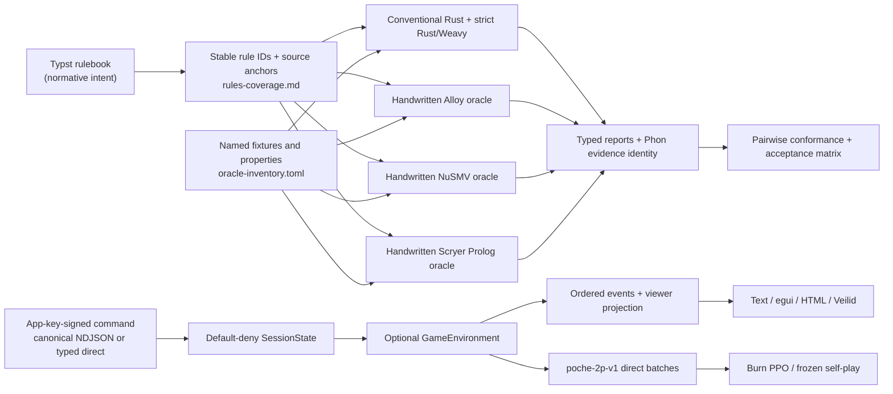

# Contributing to Poche

Poche is evidence-first: a green test is useful only when its model, rule set,
scope, backend, and confidence kind are explicit. Start with the authoritative
rules in [`docs/main.typ`](docs/main.typ), then use
[`docs/rules-coverage.md`](docs/rules-coverage.md) and
[`docs/acceptance-matrix.md`](docs/acceptance-matrix.md) to find the executable
evidence for a rule.

## How intent reaches the models



Rule IDs are stable semantic handles, not line numbers. Prose can move while an
ID remains stable; a meaning change requires updating its wording, source
anchor, every applicable track disposition, properties/fixtures, and evidence.
Never reuse an old ID for a different rule.

The strict Rust graph attaches `RuleOrigin` metadata to state, observation,
legal-action, transition, scoring, and property nodes. Alloy, NuSMV, and Prolog
retain rule IDs in their handwritten source and named fixture/property/query
adapters. Phon preserves those origins together with the rules, schema, model,
scope, scoring, observation, backend, and confidence identities. A successful
Phon decode proves only shape; semantic refinement runs again before evidence is
accepted.

## Give each backend the job it does well

| Backend | Use it for | Do not claim from it |
| --- | --- | --- |
| Conventional Rust | Complete 52-card execution for `Game<N>`, strong phase/action types, deterministic replay, observations, scoring, and focused or sampled tests across 2..51 players | Exhaustive full-game proof merely because the implementation is typed or fuzzed |
| Strict Rust + Weavy | Inspectable finite computation graphs, exact micro-scope transition enumeration, safety predicates, SCC/deadlock/liveness analysis, and counterexample projection | Results outside the named six-card, two-player `1,2,1` scope without a separate run |
| Alloy | Relational structure, card identity/partition, bounded lifecycle consistency, invalid-state rejection, and small witnesses | Unbounded truth, universal game termination, or policy-quality evidence |
| NuSMV | Symbolic transition systems, invariants, CTL/LTL safety/liveness, deadlock checks, and temporal counterexamples | Full cross-trick card identity where the model intentionally keeps counts only, or results for undeclared player/schedule scopes |
| Scryer Prolog | Legal successors, finite relational answer sets, score causes, rule explanations, and bounded ground predecessor/action questions | Universal temporal proof or productivity of an unconstrained reverse query |
| Session Rust | Complete typed room reduction, default-deny policy, app identity binding, deterministic replay, viewer projections, and exhaustive finite lobby exploration | Availability of an external network, honest-host hidden-information fairness, or unconditional session termination |
| Session Alloy / NuSMV / Prolog | Bounded authorization structure, symbolic lifecycle/liveness, and relational action/predecessor explanations over their printed scopes | The cryptographic primitives, full network implementation, 52-card game product state, or claims beyond each receipt's exact abstraction |
| Facet + Phon | Schema reflection, transport, evidence identity, semantic-envelope validation, and replayable diffs/traces | Proof that an encoded state is legal solely because bytes decoded |
| `proptest` / `Arbitrary` | Broad sampled pressure on implementations and controlled defect discovery | Exhaustiveness over the full deck or every action trace |
| Burn PPO | Tensor policy/value inference, masked optimization, frozen self-play, checkpoint replay, and empirical score evaluation | Formal proof, policy optimality, or permission to duplicate/change game rules inside the learner |

The non-Rust model files are independent oracles. They are not generated from
Rust, and Rust is not generated from them. Shared fixtures select comparable
native relations; they do not replace native source or force every language
into one API.

## Strict formal-operation boundary

Portable strict-Rust computations may use typed constants/inputs, finite
records and enums, fixed arrays, equality and finite ordering, Boolean logic,
pure conditionals, statically safe fixed indexing, and explicitly finite
`all`/`any`/bounded-sum folds. They lower to Weavy with rule/source provenance.

The strict graph rejects opaque Rust callbacks, dynamic allocation as semantic
state, unbounded loops/recursion, hidden randomness, effects, arbitrary host
calls, unsupported arithmetic, and unchecked indexing. Chance must be a finite
explicit input. If a rule requires an unsupported operation, either express a
finite equivalent, add a reviewed dialect operation with validators/tests, or
record the limitation; do not hide the computation behind a callback.

## Observation, action, chance, and scoring contracts

`GameEnvironment` is deliberately policy-neutral:

- `State` is complete hidden state; a player-facing consumer receives only
  `observe(state, viewer)`.
- An observation contains the viewer's own hand plus public phase/actor, hand
  counts, revealed trump, current trick, bids, trick counts, cumulative scores,
  and pot information. It does not reveal another hand or the undealt order.
- `turn` distinguishes agent, chance, deterministic environment settlement, and
  terminal ownership. `legal_actions` returns only actions owned by the acting
  player.
- Chance is an explicit validated deck order. Seed/provenance is replay
  metadata, not hidden transition logic or policy input.
- `transition` is deterministic for a state and explicit action. Settlement
  emits raw per-player `RoundScoreEvent` values with score and money rule
  origins.
- Rulebook points, missed-bid payments, cumulative score, communal pot, final
  winner mask, and pot division remain separate data. `terminal_status` returns
  a semantic outcome, never an RL reward.

The implemented `poche-2p-v1` RL contract uses this boundary directly. It fixes
a 307-value seat-relative observation, a 60-action vocabulary and mandatory
legal mask, and the `round-score-v1` projection. Reward is zero between scoring
boundaries and the seat's raw rulebook points at settlement because score is the
game's objective. Money, winners, score differential, and other diagnostics
remain separate metrics. Training results are empirical evidence about a named
policy and evaluation distribution. They do not prove legality, termination,
rule consistency, agreement between oracles, or global optimality.

`SessionState` is a separate reducer. It owns identity, membership, readiness,
countdown, pause/resume, chat metadata, spectator capabilities, and the gate for
entering `GameEnvironment`; it never becomes part of `GameState`. Renderers
receive only typed viewer projections. Veilid and in-process transports carry
the same command/event meanings, while RL calls the environment directly and
does not parse text or open a socket. See
[`docs/session-engine.md`](docs/session-engine.md),
[`docs/protocol-v1.md`](docs/protocol-v1.md), and
[`docs/rl-environment.md`](docs/rl-environment.md).
Slash text, GUI controls, and future votes must first become the same validated
`poche-governance-command-v1` AST; see
[`ADR 0006`](docs/decisions/0006-typed-commands-and-legality-policy.md).

## Native tools and reproducible commands

Pinned versions live in [`tools/versions.toml`](tools/versions.toml). Put the
tools on `PATH`, or set machine-local `ALLOY_BIN`, `NUSMV_BIN`,
`SCRYER_PROLOG_BIN`, and `TYPST_BIN`; never commit executable paths.

```pwsh
cargo run -p poche-xtask -- doctor
```

The doctor distinguishes unavailable tools from configured tools that fail to
execute. Native runners preserve exact commands, version banners, exit codes,
raw output, and normalized output under ignored `target/<backend>-*/`
directories. Parsers fail closed on missing, duplicate, extra, or unknown
results.

Use the smallest command that proves the claim you changed:

| Purpose | Command |
| --- | --- |
| Rule/track completeness | `cargo run -p poche-xtask -- coverage audit --all` |
| Conventional Rust oracle | `cargo run -p poche-xtask -- oracle check rust` |
| All full native oracles | `cargo run -p poche-xtask -- oracle check all` |
| Exhaustive strict micro graph | `cargo run -p poche-xtask -- check rust-explicit --scope micro` |
| Strict termination property | `cargo run -p poche-xtask -- check rust-explicit --property game-terminates` |
| Conventional/strict Rust | `cargo run -p poche-xtask -- compare rust-oracle rust-formal` |
| Rust/Scryer | `cargo run -p poche-xtask -- compare rust prolog --fixtures tests/fixtures/prolog` |
| Rust/Alloy | `cargo run -p poche-xtask -- compare rust alloy --scope micro` |
| Rust/NuSMV | `cargo run -p poche-xtask -- compare rust nusmv --scope micro` |
| Complete acceptance gate | `cargo run -p poche-xtask -- compare all --scope micro` |
| Acceptance source revisions | `cargo run -p poche-xtask -- acceptance hashes` |
| Session rule/track completeness | `cargo run -p poche-xtask -- session coverage audit --all` |
| All native session oracles | `cargo run -p poche-xtask -- session oracle check all` |
| Session cross-model agreement | `cargo run -p poche-xtask -- session compare all --scope lobby-micro` |
| Canonical protocol transcripts | `cargo run -p poche-xtask -- protocol replay --all` |
| Full no-socket room/game scenario | `cargo run -p poche-xtask -- multiplayer smoke --transport in-process` |
| Isolated-local Veilid behavior | `cargo run -p poche-xtask --offline -- multiplayer smoke --transport veilid-local` |
| RL semantic contract | `cargo run -p poche-xtask --offline -- rl spec` |
| Baseline evaluation | `cargo run -p poche-xtask --offline -- rl evaluate --manifest rl/manifests/baseline-v1.json` |
| PPO training/evaluation | `cargo run -p poche-xtask --offline -- rl train --manifest rl/manifests/poche-ppo-v1.json` then `rl evaluate` with the same manifest |
| Selected learned replay | `cargo run -p poche-xtask --offline -- rl replay --manifest rl/manifests/poche-ppo-v1.json --matchup learned-vs-heuristic --seed 3778019106` |
| Rulebook PDF | `& $env:TYPST_BIN compile --root . docs/main.typ "$env:TEMP\poche-rules.pdf"` |

Backend-specific scopes, expected SAT/UNSAT polarity, property counts, query
modes, and known limitations are documented in `docs/*-oracle.md` and
`docs/*-conformance.md`. Do not summarize a result more strongly than those
records permit.

## Evidence vocabulary

Use these words precisely in code, docs, commits, and reviews:

| Confidence | Meaning here |
| --- | --- |
| Exhaustive | Every reachable state/edge or every value in an explicitly named finite domain was enumerated or symbolically covered |
| Bounded | Solver result holds only within the exact Alloy integer/atom/step scope printed in the receipt |
| Symbolic | NuSMV checked the declared finite abstraction and property semantics, including its stated identity/count projection |
| Queried | Scryer returned the complete answer set only for the documented finite/productive mode and groundness constraints |
| Sampled | Unit/property/fuzz scenarios ran; untested values and traces may remain |
| Conformance | Two independent models agree on a declared common projection; model-specific facts outside it are not compared |
| Controlled defect | A deliberately weakened/mutated rule produces the expected witness, counterexample, or failure and demonstrates discrimination |
| Trained | A policy completed the exact named manifest and achieved empirical metrics on a named distribution; this is never silently upgraded to formal proof |

## Change workflow

1. Identify affected rule IDs and source anchors. If intent is ambiguous, update
   the rulebook/decision record before selecting an implementation as winner.
2. Update each applicable model independently. Record `n/a` with a reason where
   a tool genuinely has no useful surface; do not invent an irrelevant API just
   to fill a cell.
3. Add or update a named property, query, fixture, counterexample, or controlled
   defect. A property that cannot fail under a known defect is not adequate
   evidence.
4. Update `docs/rules-coverage.md`, conformance/limitation docs, and the
   acceptance matrix. Recompute acceptance hashes when a hashed source family
   changes.
5. Run formatting, linting, tests, coverage, the affected native engines, the
   affected pairwise comparison, and finally the aggregate gate when the change
   affects accepted claims.
6. Inspect raw native diagnostics and any counterexample, not just the final
   `passed` line. Confirm that declared versions, scopes, counts, and hashes
   match the documentation.

Before release-level acceptance, run:

```pwsh
cargo fmt --all --check
cargo clippy --workspace --all-targets --offline -- -D warnings
cargo test --workspace --offline
cargo run -p poche-xtask --offline -- coverage audit --all
cargo run -p poche-xtask --offline -- compare all --scope micro
cargo run -p poche-xtask --offline -- session coverage audit --all
cargo run -p poche-xtask --offline -- session compare all --scope lobby-micro
cargo run -p poche-xtask --offline -- protocol replay --all
cargo run -p poche-xtask --offline -- multiplayer smoke --transport veilid-local
```

The local Veilid command checks semantic behavior and records the released
0.5.7 isolated-topology limitation; it does not contact the public network or
prove public routing. The public two-process command is deliberately guarded by
an exact environment acknowledgement. Use it only for a release that changes
native transport behavior and follow
[`docs/veilid-native-acceptance.md`](docs/veilid-native-acceptance.md).

Before changing multiplayer, also inspect the
[capability matrix](docs/capability-matrix.md),
[deployment modes](docs/deployment-modes.md), and
[session coverage](docs/session-coverage.md). A room code is a temporary invite,
never a durable authorization token. Stable application keys authorize
membership; transport IDs do not. Revocation stops future spectator hand
delivery and cannot erase prior knowledge. The host-authoritative process can
inspect every hand, and a Datastar operator can additionally observe ordinary
server metadata; do not describe either topology as trustless or anonymous.

RL changes must update the immutable spec/manifest ID when observation, action,
history, mask, reward, or tensor semantics change. Keep large weights, replay
corpora, logs, PDFs, and web bundles ignored. Commit the small manifest,
semantic probe, digest, and score-first summary needed to reproduce and classify
the result.

## LLM-authored changes

LLM output is a proposed patch, not evidence. Disclose substantive LLM use in
the pull request and describe which rules/models/tests it touched. The author
must review the complete diff and remains responsible for its semantics,
license/provenance, scopes, and claims.

In particular:

- do not count several translations produced from one LLM-generated source as
  independent oracle agreement;
- do not accept invented rule text, citations, tool output, versions, solver
  scopes, hashes, or test results without checking the authoritative source or
  running the command;
- require native execution for native-model claims and controlled negative
  evidence for important properties;
- preserve a discrepancy until it is classified against a rule ID—never let an
  LLM silently choose Rust, Alloy, NuSMV, Prolog, or legacy behavior as truth;
- review generated code for unsupported strict-graph operations, hidden chance,
  observation leakage, accidental reward semantics, and copied material; and
- keep automatic target-language generation deferred unless a later explicit
  goal changes G12 while retaining the handwritten oracle baselines.

The pull-request template turns these obligations into a review checklist.

## Deferred boundaries

Automatic target-language generation and comparison with legacy `v2` remain
deferred design context. Multiplayer deliberately stops short of trustless
dealing, host migration, production account/matchmaking/moderation services, a
packaged end-user Veilid client, and production hardening of the hostable web
demo. Rendering deliberately stops before card art, animation, sound, and
polished/mobile accessibility work. RL currently fixes only two-player
`poche-2p-v1`; more player counts, recurrent/population policies, distributed
training, and claims of optimal play require new versioned plans and evidence.
