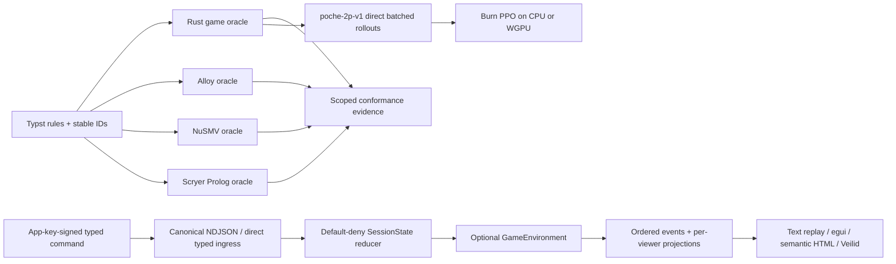

# Poche

Poche is an evidence-first card-game system: the rulebook is implemented as
independent Rust, Alloy, NuSMV, and Scryer Prolog oracles, then composed with a
typed multiplayer session protocol, viewer-scoped rendering, native Veilid
transport, and a network-free Burn PPO learning path. Each result records what
was exhaustive, bounded, symbolic, queried, sampled, or merely empirical.

- [Completed formal-modeling plan](PLAN.md)
- [Completed multiplayer, rendering, and RL plan](PLAN-2-MULTIPLAYER-RL-RENDERING.md)
- [Contributor and evidence guide](CONTRIBUTING.md)
- [Typst rule source](docs/main.typ)
- [Pretty rules](https://teamdman.github.io/Poche/) — generated from the
  `model-checking` branch by GitHub Pages
- [Direct rulebook PDF](https://teamdman.github.io/Poche/poche-rules.pdf)
- [Static exact-projection replay](https://teamdman.github.io/Poche/replay/) —
  browser egui/WASM fixture; no room authority or network
- [Deployment-mode matrix](docs/deployment-modes.md)
- [Native Veilid acceptance](docs/veilid-native-acceptance.md)
- [Burn PPO learner and evaluation](docs/burn-learning.md)
- [Publication and format decision](docs/pages-publication.md)

Automatic target-language generation, trustless dealing, host migration,
production account/matchmaking infrastructure, polished rendering, and RL
specifications beyond fixed two-player `poche-2p-v1` remain separate work.

## Architecture



`SessionState` decides membership, readiness, countdown, pause, chat, grants,
and whether a game transition may occur. `GameEnvironment` remains the sole
game-rule authority. Network adapters and renderers consume typed commands and
viewer projections; they do not duplicate authorization or legality. RL calls
the game environment directly, so rollouts do not parse NDJSON or open sockets.

The exact session-rule matrix is in
[session-coverage.md](docs/session-coverage.md); the rule/model distinction and
accepted proof scopes are in [CONTRIBUTING.md](CONTRIBUTING.md).

## Inspect the system

Install the pinned tools listed by `doctor`, or set machine-local `ALLOY_BIN`,
`NUSMV_BIN`, `SCRYER_PROLOG_BIN`, and `TYPST_BIN`. Do not commit executable
paths.

```pwsh
cargo run -p poche-xtask -- doctor
cargo run -p poche-xtask -- protocol replay --all
cargo run -p poche-xtask -- session compare all --scope lobby-micro
cargo run -p poche-xtask -- multiplayer smoke --transport in-process
cargo run -p poche-cli -- --output text transcript replay tests/fixtures/protocol/session-micro-v1.script.ndjson
```

The CLI schema includes `room`, `game`, `chat`, `spectator`, `transcript`, and
`identity` commands with text/JSON/NDJSON output. Transcript commands execute
locally today; the other groups are a typed, secret-safe client boundary used
by tests and future packaged clients, not a claim that a standalone CLI process
already joins a live Veilid room. Run `cargo run -p poche-cli -- --help` for the
complete command vocabulary.

The checked script is the most inspectable lifecycle: host and join, seat and
ready, abort and re-arm a countdown, start, pause by Alice, resume by Bob, chat,
spectator request/grant/revoke, reconnect, complete the game, reset, and close.
Native public-network acceptance also covers player leave and host close.

## Rooms, identity, and privacy

A room code is a versioned, checksummed, expiring/one-time rendezvous invite. It
is not lasting authority. Successful redemption binds a host-signed membership
to the participant's stable application public key; reconnect uses that key and
a protected locator, not the original code. Veilid node IDs and private routes
may rotate without changing the application principal. See
[application identity](docs/application-identity.md),
[rendezvous](docs/veilid-rendezvous.md), and
[membership reconnect](docs/membership-reconnect.md).

Chat is authorized, attributed, size/rate bounded, and intentionally ephemeral
with a 64-entry default in-memory tail. Spectators may request exactly one
player's hand; only that player may grant or revoke it. Each recipient gets an
independent projection and encrypted delivery. Revocation stops subsequent
delivery at the next projection epoch—it cannot erase cards already observed.
See [chat](docs/ephemeral-chat.md),
[viewer projections](docs/viewer-projections.md), and
[Veilid projection privacy](docs/veilid-projection-privacy.md).

The first multiplayer design is host-authoritative. The host process owns all
hidden state and can inspect or manipulate it; this is not mental poker,
consensus, or proof against a cheating host. Application signatures and
capabilities authorize commands independently of transport identity, but they
do not hide IP/timing/DHT metadata from the relevant transport participants.

| Mode | What is proven | Privacy and operational boundary |
| --- | --- | --- |
| GitHub Pages replay | Static rulebook and exact checked projections | No live room, authority, identity, or network |
| Native Veilid protocol | Guarded two-process public DHT/private-route lifecycle, stable keys, signed commands/events, encrypted recipient projections | No packaged player client; Veilid peers can observe network metadata; the host sees all hands |
| Direct browser Veilid | Not supported with Veilid 0.5.7 from a Pages HTTPS origin | Public WSS bootstrap/relay topology failed; no companion app is implied |
| Self-hosted Datastar demo | Host-colocated Axum authority and accessible semantic HTML work on loopback | Development invite/viewer routes are not production authentication; the operator sees connection metadata and, as host, all state |

Do not expose the Datastar demo beyond loopback without adding TLS,
authentication, durable state, abuse controls, and a deployment-specific threat
review. Its current development command is:

```pwsh
cargo run --locked --release -p poche-web-spike
```

## Reinforcement learning

`poche-2p-v1` fixes a 307-value seat-relative observation, 60-action vocabulary,
legal mask, public-history contract, and `round-score-v1` reward. Reward is zero
between round boundaries and the seat's raw Poche points at settlement. Score,
not a chess-like material proxy, is also the primary evaluation measure.

```pwsh
cargo run -p poche-xtask --offline -- rl spec
cargo run -p poche-xtask --offline -- rl benchmark --steps 1000000 --batch 256
cargo run -p poche-xtask --offline -- rl train --manifest rl/manifests/poche-ppo-v1.json
cargo run -p poche-xtask --offline -- rl evaluate --manifest rl/manifests/poche-ppo-v1.json
cargo run -p poche-xtask --offline -- rl replay --manifest rl/manifests/poche-ppo-v1.json --matchup learned-vs-heuristic --seed 3778019106
```

The manifest pins semantics, shapes, seeds, hyperparameters, corpus, and artifact
location. Large checkpoints and episodes stay in ignored `artifacts/`; Git keeps
small manifests, summaries, semantic probes, and digests. Training and held-out
scores are empirical policy evidence only. They do not prove legality,
termination, consistency, global optimality, or agreement with the independent
formal oracles; those claims retain their own evidence tracks.

## Release checks

The normal network-free release gate is:

```pwsh
cargo fmt --all --check
cargo clippy --workspace --all-targets --offline -- -D warnings
cargo test --workspace --offline
cargo run -p poche-xtask --offline -- coverage audit --all
cargo run -p poche-xtask --offline -- compare all --scope micro
cargo run -p poche-xtask --offline -- session coverage audit --all
cargo run -p poche-xtask --offline -- session compare all --scope lobby-micro
cargo run -p poche-xtask --offline -- multiplayer smoke --transport veilid-local
```

The isolated-local Veilid topology intentionally reports that it cannot prove
public DHT/private-route delivery. The public acceptance command is opt-in and
requires the exact acknowledgement documented in
[veilid-native-acceptance.md](docs/veilid-native-acceptance.md); never run it as
an ordinary test or RL rollout.

## License

Poche is licensed under the [Mozilla Public License 2.0](LICENSE).
