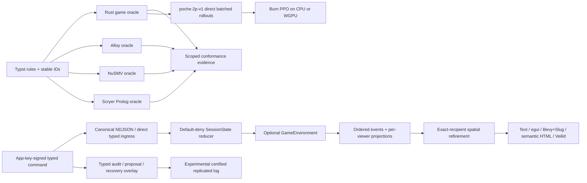

# Poche

Poche is an evidence-first card-game system: the rulebook is implemented as
independent Rust, Alloy, NuSMV, and Scryer Prolog oracles, then composed with a
typed multiplayer session protocol, viewer-scoped rendering, native Veilid
transport, checked spatial refinement, typed governance, an experimental
replicated log, a bounded hidden-card research prototype, and a network-free
Burn PPO learning path. Each result records what was exhaustive, bounded,
symbolic, queried, sampled, experimental, or merely empirical.

- [Completed formal-modeling plan](PLAN.md)
- [Completed multiplayer, rendering, and RL plan](PLAN-2-MULTIPLAYER-RL-RENDERING.md)
- [Completed spatial tabletop and distributed-agency plan](PLAN-3-DISTRIBUTED-TABLETOP-SPATIAL.md)
- [Completed player-facing web plan](PLAN-4-PLAYER-WEB-EXPERIENCE.md)
- [Active desktop Veilid, shared card movement, and recovery plan](PLAN-6-DESKTOP-VEILID.md) — implementation in progress; not yet a playable Veilid desktop release.
- [Previous unified executable, device-orchestration, capture, and puppet plan](PLAN-5-LIVE-CONTROL-PUPPETS.md)
- [Unified executable, device, capture, agent, and puppet guide](docs/live-control-puppets.md)
- [Contributor and evidence guide](CONTRIBUTING.md)
- [Architecture decision index](docs/decisions/README.md)
- [Phase 3 release summary and machine receipt](docs/phase-3-release.md)
- [Typst rule source](docs/main.typ)
- [Pretty rules](https://teamdman.github.io/Poche/) — generated from the
  `model-checking` branch by GitHub Pages
- [Engineering status](https://teamdman.github.io/Poche/status.html) — what is
  implemented, what each experiment established, and the remaining boundaries
- [Direct rulebook PDF](https://teamdman.github.io/Poche/poche-rules.pdf)
- [Static exact-projection replay](https://teamdman.github.io/Poche/replay/) —
  browser egui/WASM fixture; no room authority or network
- [Deployment-mode matrix](docs/deployment-modes.md)
- [Native Veilid acceptance](docs/veilid-native-acceptance.md)
- [Burn PPO learner and evaluation](docs/burn-learning.md)
- [Publication and format decision](docs/pages-publication.md)
- [Bounded spatial Alloy oracle](docs/spatial-alloy.md)
- [Symbolic spatial NuSMV oracle](docs/spatial-nusmv.md)
- [Relational spatial Scryer Prolog oracle](docs/spatial-prolog.md)
- [Neutral spatial conformance and coverage](docs/spatial-coverage.md)
- [Native canonical spatial mirror and Slug evidence](docs/native-spatial-ui.md)
- [Accessible semantic HTML tabletop and browser acceptance](docs/semantic-html-tabletop.md)
- [Complete spatial vertical slice and checked transcript](docs/spatial-vertical-slice.md)
- [Published spatial evidence](https://teamdman.github.io/Poche/spatial.html) —
  Rust-rendered endpoint and bounded Alloy counterexample; no live room
- [Typed command and legality-policy decision](docs/decisions/0006-typed-commands-and-legality-policy.md)
- [Retrospective action audit](docs/retrospective-audit.md)
- [Replicated player/device authority decision](docs/decisions/0007-player-device-and-replicated-log.md)
- [Bounded verifiable hidden-card prototype decision](docs/decisions/0008-hidden-card-prototype.md)
- [Routed room codes and gateway trust decision](docs/decisions/0009-routed-room-codes-and-gateway-trust.md)
- [Signed browser-device HTTP/SSE gateway evidence](docs/browser-device-gateway.md)
- [Runtime diagnostics and formal-worker capability boundary](docs/runtime-diagnostics-and-formal-workers.md)
- [Secure-browser Veilid feasibility re-evaluation](docs/veilid-browser-feasibility.md)
- [Replicated runtime convergence scenario](docs/replicated-runtime.md)
- [Replicated consensus formal evidence and coverage](docs/consensus-coverage.md)
- [Player-facing web client](docs/player-web-client.md) — dynamic names,
  per-tab sessions, opaque shared room codes, and the game-like tabletop
- [Diegetic semantic projection](docs/diegetic-semantic-projection.md) — one
  typed action space projected into native 3D, HTML/CSS, text, and future views

Automatic target-language generation, a security-reviewed dropout-tolerant
hidden-card protocol, a packaged replicated player client, production account/
matchmaking infrastructure, polished rendering, and RL specifications beyond
fixed two-player `poche-2p-v1` remain separate work. Phase 3 contains bounded
prototypes for replication and mental poker; neither is advertised as a
production deployment.

## Architecture



`SessionState` decides membership, readiness, countdown, pause, chat, grants,
and whether a game transition may occur. `GameEnvironment` remains the sole
game-rule authority. Network adapters and renderers consume typed commands and
viewer projections; they do not duplicate authorization or legality. RL calls
the game environment directly, so rollouts do not parse NDJSON or open sockets.

The exact session-rule matrix is in
[session-coverage.md](docs/session-coverage.md); the rule/model distinction and
accepted proof scopes are in [CONTRIBUTING.md](CONTRIBUTING.md).

## Canonical state, spatial input, and rule strength

Typed Poche/session state is the source of truth. A viewer-safe projection can
be realized into exact integer objects, zones, poses, and semantically attached
text. A named command or classified drag then resolves back to the same typed
intent. Bevy entities, arbitrary ECS component combinations, floating-point
transforms, HTML layout, and Slug glyph placement are presentation/input
adapters; none can create a card, alter a score, or reveal a face.

Legality is deliberately configurable without weakening structural integrity.
A room can prevent an illegal move, retain a structurally valid attempt for
later audit, automatically propose a remedy when new evidence confirms a
violation, or let a player manually accuse a recorded action. Governance may
adjust scores/rights or choose kick/redeal/end through typed authority and
visible voting. It cannot vote new cards into existence, rewrite signed
history, or forge device identity. See [governance](docs/governance.md),
[retrospective audit](docs/retrospective-audit.md), and
[ADR 0006](docs/decisions/0006-typed-commands-and-legality-policy.md).

## Inspect the system

Install the pinned tools listed by `doctor`, or set machine-local `ALLOY_BIN`,
`NUSMV_BIN`, `SCRYER_PROLOG_BIN`, and `TYPST_BIN`. Do not commit executable
paths.

```pwsh
cargo run -p poche-xtask -- doctor
cargo run -p poche-xtask -- protocol replay --all
cargo run -p poche-xtask -- session compare all --scope lobby-micro
cargo run -p poche-xtask --offline -- spatial alloy --scope layout-micro
cargo run -p poche-xtask --offline -- spatial nusmv --scope transition-micro
cargo run -p poche-xtask --offline -- spatial prolog --scope query-micro
cargo run -p poche-xtask --offline -- spatial compare all --scope micro
cargo run -p poche-xtask --offline -- spatial coverage audit --all
cargo run -p poche-xtask --offline -- spatial vertical-slice
cargo run -p poche-xtask --offline -- pages build
cargo run --release -p poche-native-ui -- --debug-overlay
cargo run -p poche-cli --offline -- --output json command parse '/startvote "/score add player1 100"'
cargo run -p poche-xtask -- multiplayer smoke --transport in-process
cargo run -p poche-cli -- --output text transcript replay tests/fixtures/protocol/session-micro-v1.script.ndjson
```

## One executable, several certified devices

`poche.exe` now opens the native graphical client with no arguments and also
provides the command-line, persistent-agent, cross-device capture, transcript,
and puppet workflows. A CLI or policy is its own root-certified device; it does
not find and remote-control a resident window or borrow that window's key.

```powershell
cargo build --locked --offline -p poche-cli
target\debug\poche.exe
target\debug\poche.exe identity create alice
target\debug\poche.exe device create alice alice-desktop
target\debug\poche.exe device create alice alice-agent
target\debug\poche.exe --output json puppet list
target\debug\poche.exe --output json puppet run two-player-full-round --surface headless --transport loopback-ndjson --seed 1
target\debug\poche.exe puppet artifacts open
```

Native and browser puppets are windowless by default. Native capture uses a
Bevy image target without a primary window; browser capture uses headless
browser mode. Pass `--show-window` only for interactive native debugging.
Successful runs publish a verified HTML contact sheet, manifest, exact semantic
steps, lifecycle evidence, and any surface captures under ignored `target/`
storage. See the [phase-five workflow guide](docs/live-control-puppets.md) for
protected profiles, live GUI/CLI/agent participation, sibling-device capture,
artifact inspection, puppet authoring, and the precise transport/privacy
qualifications.

## Play in two browser tabs

Run the local server, then open `http://127.0.0.1:4174/`:

```powershell
cargo run --locked -p poche-web-spike --offline
```

Enter any display name and create a lobby. Copy the generated `PCH-…` room
code, open the main menu in a second tab, choose another name, and join with
that code. Each tab stores its name in tab-scoped `sessionStorage` and receives
a different secret session URL, so tabs do not collapse into one hard-coded
Alice/Bob identity. Take different seats, ready both players, and let the
creator start the countdown. Phase-appropriate bid/play controls then drive the
same typed reducer used by the formal and transcript checks.

Human-facing cards use `♣ ♦ ♥ ♠`. Clicking or dragging a card and choosing its
matching `Play …` command are equivalent typed actions. The command palette also
links to full room chat and separates ordinary table actions from confirmed
leave/close actions. `Exit table` retains membership and a resumable tab
session. `Leave room` ends only that membership: the same room code can later
admit a fresh spectator principal, including while play is active. Closing the
room remains terminal for everyone. Both leave and close use explicit terminal
screens instead of silently navigating or leaving stale controls behind.

The normal player path is intentionally full-viewport and game-like. Deep
diagnostics are collapsed, and the old deterministic Alice/Bob harness now
lives at `/lab`. The current room registry is process-local development state;
the browser-device gateway, Veilid, replicated authority, and production invite
semantics remain separately scoped experiments. See
[player-web-client.md](docs/player-web-client.md).

The same executable includes `room`, `game`, `chat`, `spectator`, `transcript`,
`identity`, `device`, `agent`, and `puppet` commands with text/JSON/NDJSON
output. The live device commands are packaged against the disclosed HTTP
gateway endpoint and use protected, independently certified profiles. This is
not a claim that the CLI currently joins through public Veilid: native/public
Veilid lifecycle acceptance remains a separately guarded transport test, and
public Veilid capture transfer is not advertised. Run `poche.exe --help` for
the complete command vocabulary.

The checked script is the most inspectable lifecycle: host and join, seat and
ready, abort and re-arm a countdown, start, pause by Alice, resume by Bob, chat,
spectator request/grant/revoke, reconnect, complete the game, reset, and close.
Native public-network acceptance also covers player leave and host close.

## Rooms, identity, and privacy

A room code is a versioned, checksummed, expiring/one-time rendezvous invite. It
is not lasting authority. Successful redemption binds a host-signed membership
to the participant's stable application public key; reconnect uses that key and
a protected locator, not the original code. Veilid node IDs and private routes
may rotate without changing the application principal. See
[application identity](docs/application-identity.md),
[rendezvous](docs/veilid-rendezvous.md), and
[membership reconnect](docs/membership-reconnect.md).

Chat is authorized, attributed, size/rate bounded, and intentionally ephemeral
with a 64-entry default in-memory tail. Spectators may request exactly one
player's hand; only that player may grant or revoke it. Each recipient gets an
independent projection and encrypted delivery. Revocation stops subsequent
delivery at the next projection epoch—it cannot erase cards already observed.
See [chat](docs/ephemeral-chat.md),
[viewer projections](docs/viewer-projections.md), and
[Veilid projection privacy](docs/veilid-projection-privacy.md).

The first deployable multiplayer design is host-authoritative. The host process
owns all hidden state and can inspect or manipulate it; this is not mental
poker, consensus, or proof against a cheating host. Application signatures and
capabilities authorize commands independently of transport identity, but they
do not hide IP/timing/DHT metadata from the relevant transport participants.

Phase 3 also checks two deliberately narrower alternatives. The experimental
`poche-replicated-v1` log gives one player several independently revocable
device keys without additional voting weight and converges only under its named
majority, delivery, and non-equivocation assumptions. The research-only
`poche-mental-poker-bg12-v0` prototype verifies full-deck shuffle/deal/reveal,
but unanimous reveal means one withheld share aborts the current hand; typed
governance can kick/redeal/end, not recover the missing secret. Neither track
is a packaged live client or a production security claim.

| Mode | What is proven | Privacy and operational boundary |
| --- | --- | --- |
| GitHub Pages replay | Static rulebook and exact checked projections | No live room, authority, identity, or network |
| Native Veilid protocol | Guarded two-process public DHT/private-route lifecycle, stable keys, signed commands/events, encrypted recipient projections | The packaged live CLI currently uses HTTP/gateway rather than Veilid; public capture transfer is unqualified; Veilid peers can observe network metadata; the host sees all hands |
| Direct browser Veilid | Not supported with Veilid 0.5.7 from a Pages HTTPS origin | Public WSS bootstrap still resets before TLS; upstream deprecated WSS and the replacement WebTransport checklist remains open; no companion app is implied |
| Self-hosted Datastar demo | Host-colocated Axum authority and accessible semantic HTML work on loopback | Development invite/viewer routes are not production authentication; the operator sees connection metadata and, as host, all state |
| Signed browser-device gateway lab | Browser-local WebCrypto key, signed bounded typed HTTP, idempotent receipts, reconnectable exact-recipient SSE, and independent device revocation work on loopback | Still host-authoritative and plaintext to the gateway; lab enrollment is not the replicated root-certificate path |
| Native spatial mirror | Bevy 0.19 renders checked and live exact-recipient scenes, filled antialiased Slug card/score surfaces, typed/drag parity, deterministic tween, and real windowless capture targets | The live carrier is currently HTTP/gateway, not a packaged Veilid player; Slug fill is CPU-rasterized from the analytic coverage contract rather than a transplanted Vulkan shader, and this is not physics authority or input-to-photon evidence |
| Unified device and puppet workflows | One `poche.exe`, protected sibling profiles, GUI/CLI/policy parity, same-player capture, and full headless/browser/native multi-device runs | Captures are presentation evidence, not state authority or formal proof; public Veilid capture transfer is unsupported |
| Semantic HTML tabletop | Ordinary landmarks, tables, lists, POST forms, keyboard controls, optional drag/drop, exact-recipient privacy, audit, governance, and reconnect run over the same spatial semantics | Loopback development identities are not production authentication; live authority remains host-colocated and trusted |
| Published spatial evidence | One checked 185-record NDJSON stream, native/HTML scene fingerprint, Rust-rendered endpoint, and retained bounded Alloy overlap witness | Static composition of registered fixtures and reducers; not one atomic network execution, a live authority, or an unbounded spatial theorem |
| Experimental replicated log | Multi-device certificates, player-deduplicated quorum, deterministic ordering, snapshot/tail replay, fork evidence, and four-model micro-scope agreement | In-process/formal experiment under majority and non-equivocation assumptions; not Byzantine fault tolerance or a deployed transport |
| Hidden-card research prototype | Full 52-card verifiable shuffle, private deal receipt, public play reveal, complete audit, tamper vectors, and five governable abort points | Pins experimental unaudited cryptography, requires unanimous shares and external security review, and has no same-hand dropout recovery |

Do not expose the Datastar demo beyond loopback without adding TLS,
authentication, durable state, abuse controls, and a deployment-specific threat
review. Its current development command is:

```pwsh
cargo run --locked --release -p poche-web-spike
```

The ordinary peer demo is at `/`; the signed device lab is at `/gateway`; the
accessible semantic tabletop is at `/tabletop/alice` (with Bob and spectator
viewer links on the page).

## Reinforcement learning

`poche-2p-v1` fixes a 307-value seat-relative observation, 60-action vocabulary,
legal mask, public-history contract, and `round-score-v1` reward. Reward is zero
between round boundaries and the seat's raw Poche points at settlement. Score,
not a chess-like material proxy, is also the primary evaluation measure.

```pwsh
cargo run -p poche-xtask --offline -- rl spec
cargo run -p poche-xtask --offline -- rl benchmark --steps 1000000 --batch 256
cargo run -p poche-xtask --offline -- rl train --manifest rl/manifests/poche-ppo-v1.json
cargo run -p poche-xtask --offline -- rl evaluate --manifest rl/manifests/poche-ppo-v1.json
cargo run -p poche-xtask --offline -- rl replay --manifest rl/manifests/poche-ppo-v1.json --matchup learned-vs-heuristic --seed 3778019106
```

The manifest pins semantics, shapes, seeds, hyperparameters, corpus, and artifact
location. Large checkpoints and episodes stay in ignored `artifacts/`; Git keeps
small manifests, summaries, semantic probes, and digests. Training and held-out
scores are empirical policy evidence only. They do not prove legality,
termination, consistency, global optimality, or agreement with the independent
formal oracles; those claims retain their own evidence tracks.

## Release checks

The normal network-free release gate is:

```pwsh
cargo fmt --all --check
cargo clippy --workspace --all-targets --offline -- -D warnings
cargo test --workspace --offline
cargo run -p poche-xtask --offline -- coverage audit --all
cargo run -p poche-xtask --offline -- compare all --scope micro
cargo run -p poche-xtask --offline -- session coverage audit --all
cargo run -p poche-xtask --offline -- session compare all --scope lobby-micro
cargo run -p poche-xtask --offline -- session compare all --scope governance-micro
cargo run -p poche-xtask --offline -- spatial compare all --scope micro
cargo run -p poche-xtask --offline -- consensus compare all --scope micro
cargo run -p poche-xtask --offline -- trustless smoke --scenario dropout
cargo run -p poche-xtask --offline -- multiplayer smoke --transport veilid-local
```

The isolated-local Veilid topology intentionally reports that it cannot prove
public DHT/private-route delivery. The public acceptance command is opt-in and
requires the exact acknowledgement documented in
[veilid-native-acceptance.md](docs/veilid-native-acceptance.md); never run it as
an ordinary test or RL rollout.

The checked Phase 3 release receipt is
[`docs/evidence/phase-3-release.json`](docs/evidence/phase-3-release.json). It
records tool versions, formal counts/hashes, renderer and RL diagnostics,
resolved-license provenance, secret scans, and explicit non-claims.

## License

Poche is licensed under the [Mozilla Public License 2.0](LICENSE).
