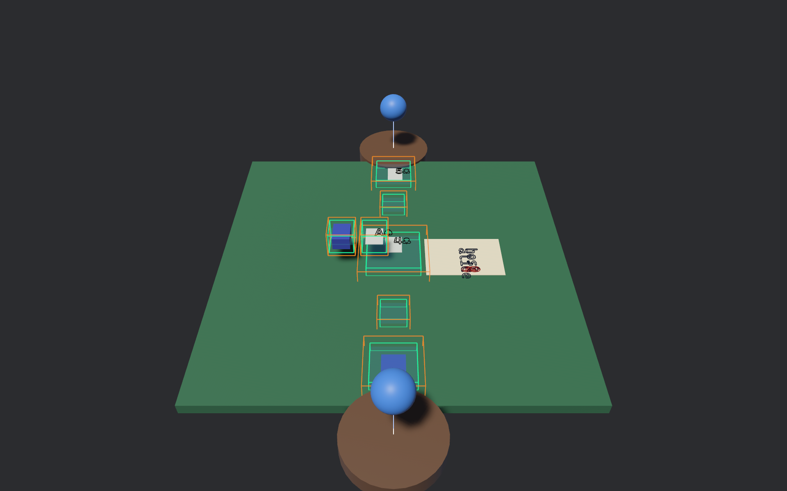

# Native canonical spatial mirror

Phase 8.1 adds a Windows-first Bevy 0.19 leaf application that renders the
same exact-recipient `SpatialScene` used by the neutral spatial checks. It is a
renderer and input adapter, not another game engine: the immutable scene keeps
stable object IDs, typed card locations, viewer-authorized faces, and semantic
text attachments. Bevy `Transform` values are derived presentation state.



The screenshot is the checked release-window acceptance artifact. Cyan boxes
are exclusive inner snap volumes; orange boxes are outer/dead-band volumes.
The committed `4♣` is in the central play zone. Only three face runs exist for
this exact viewer; 49 card objects remain backs with no face text.

## Architecture and controls

- `poche-slug` is the MPL-2.0 extraction of Teamy Terminal's pinned outline,
  directional-band, packed-word, metadata, and independent CPU coverage
  contract. It accepts explicit font bytes and has no terminal, Ash, Bevy, or
  absolute path dependency.
- `poche-native-ui` is the only Bevy-dependent crate. Each entity mirrors a
  canonical `ObjectId`, endpoint `PoseMm`, and, for cards, `CardLocation`.
  Presentation-only drag offsets and tween clocks cannot edit those records.
- Semantic `TextRun` records are children of their exact card/score-sheet
  surface with the registered local z offset. Slug extracts the actual
  Caskaydia Cove outlines, including `♣♦♥♠`, and produces buffer-ready curve,
  band, and metadata packets. The current slice visualizes the curves through
  Bevy's 3D gizmo line pass; it does not claim the Teamy Vulkan analytic shader
  was transplanted.
- Press `P` for the first owned typed play, drag an owned card onto the play
  volume for the picking path, and press `F3` for the spatial audit overlay.
  Both input paths call the same `resolve_card_play`/`resolve_drag_play`
  contract and reconstruct the same 300 ms smooth-step endpoint.

Run the interactive release application with:

```pwsh
cargo run --release -p poche-native-ui -- --debug-overlay
```

Reproduce the bounded acceptance artifact without calling it input-to-photon
latency:

```pwsh
cargo build -p poche-native-ui --release --offline
target\release\poche-native-ui.exe `
  --play-card first `
  --debug-overlay `
  --screenshot target\acceptance\native-spatial.png `
  --acceptance-report target\acceptance\native-spatial.json `
  --exit-after-seconds 6
```

## Verification and measured evidence

The 2026-08-05 release-window run produced the raw checked receipt in
[`evidence/native-spatial-acceptance.json`](evidence/native-spatial-acceptance.json)
and screenshot SHA-256
`ab9e2c4c0e02bb609e4411531a000b90a191c89e7c80e920a795b6386ddcad7d`.

| Observation | Result |
| --- | ---: |
| Process start to first Bevy update | 716.681 ms |
| Named semantic resolve/commit | 500 ns (0 µs at integer-microsecond precision) |
| Sampled presented frames | 733 |
| Mean sampled frame interval | 7.212 ms |
| p95 sampled frame interval | 7.486 ms |
| Scene objects / cards / semantic text runs | 13 / 52 / 7 |
| Authorized face runs / hidden cards without face runs | 3 / 49 |

Five focused native tests pass: CLI face parsing, real suit outlines and packed
metadata, Slug all-curves/banded CPU parity, named/drag transition equality,
and absence of invented hidden-face text or canonical scene mutation. The two
extracted Slug source tests, strict focused Clippy, and optimized offline build
also pass.

The timing is local release-process evidence. The semantic number measures the
resolver-to-accepted-record path for the startup CLI action; frame intervals
measure Bevy presentation sampling. No OS input-injection timestamp or display
instrument was used, so this is deliberately not an input-to-photon claim.

## Scope boundary

This is a faithful projection of a checked replay checkpoint, not a packaged
live Veilid player client. It has no physics authority and cannot create cards,
change scores through glyph placement, or make a loose transform into a legal
Poche transition. Visual polish, analytic GPU Slug fill, browser parity, and the
complete multiplayer/governance vertical slice remain later plan work.
